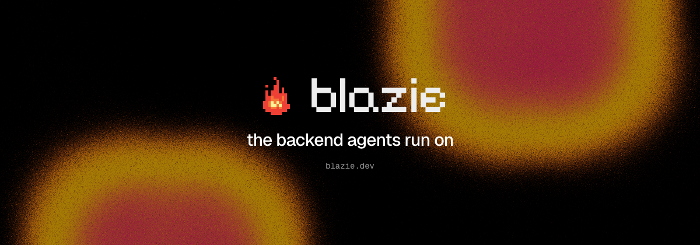
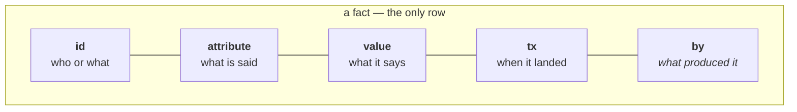
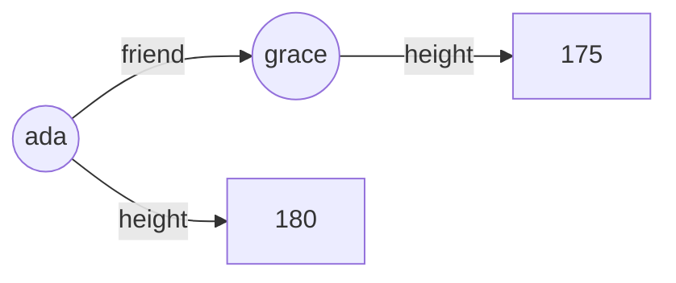
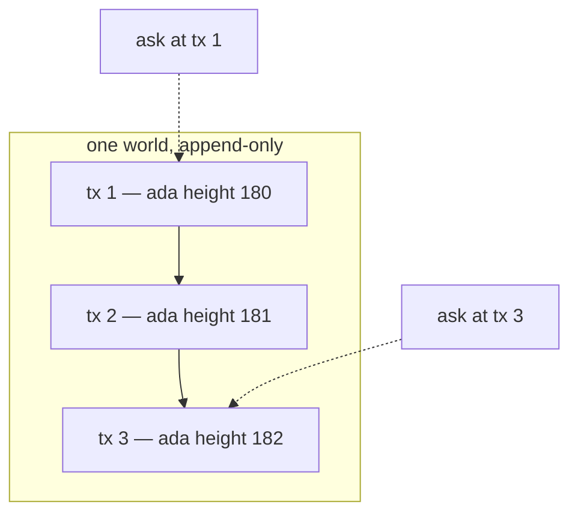
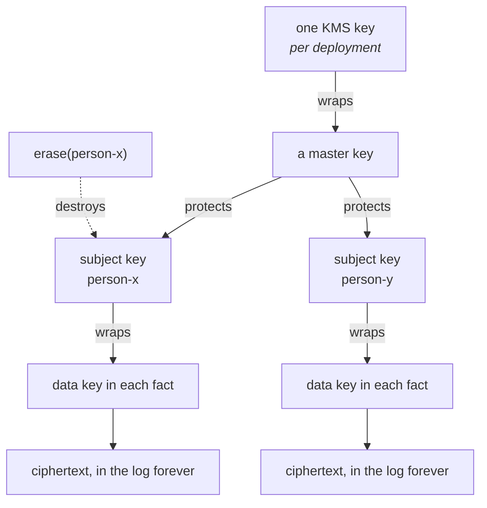
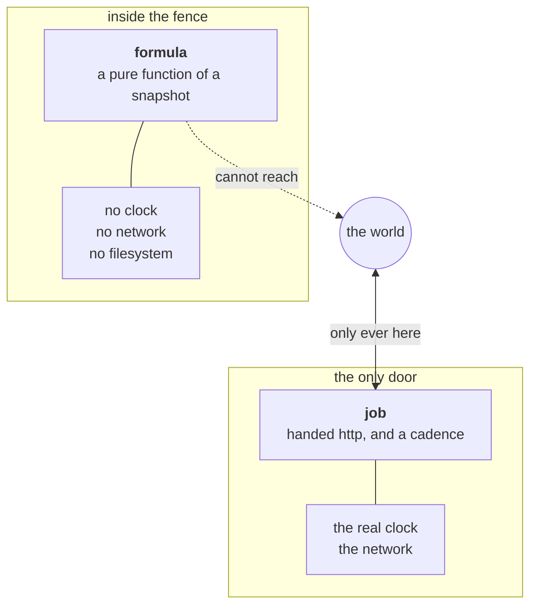
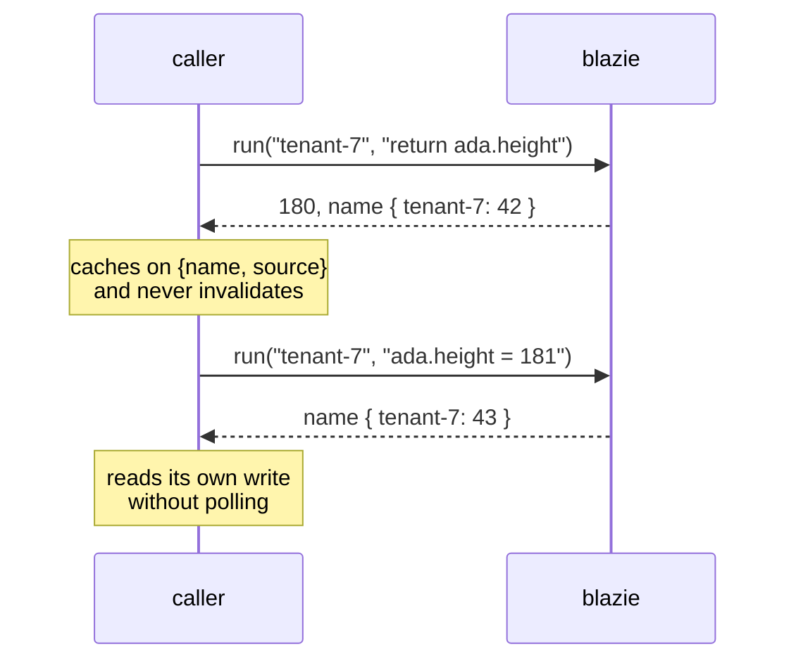
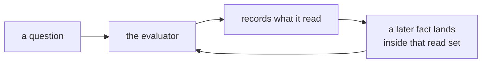
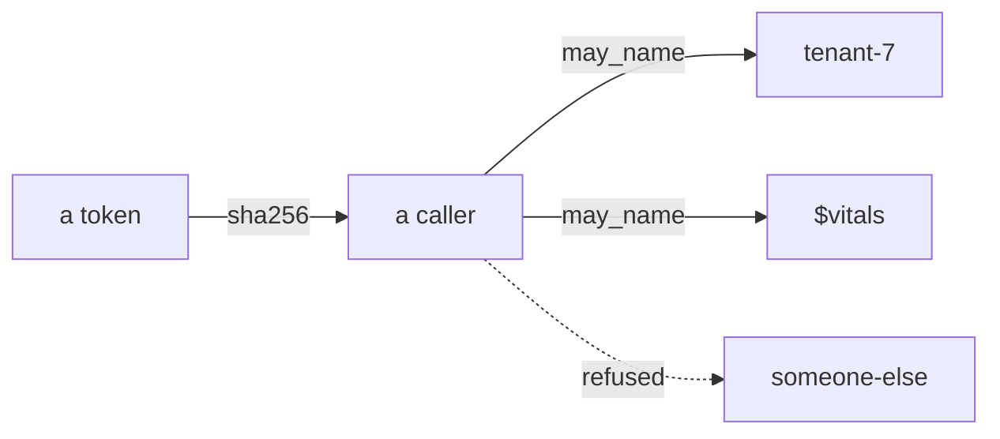

<p align="center">
  
</p>

# Why blazie is shaped like this

This is not a feature list. It is the set of decisions the code is made of, and
what each one costs — because a design document that only lists what a system
does is a brochure, and the useful part of any design is what it gave up.

Every claim here is enforced somewhere. The vocabulary lives in a database
(`.monty/ontology.db`) that the build lints against the code, and the reasoning
lives in that same database as twenty-four numbered doctrines. This file is the
tour; those are the source.

---

## 1. The problem

An agent that cannot say where an answer came from is guessing convincingly.

That is the whole motivation. Everything else follows from taking it literally:
if provenance matters, it cannot be a column somebody remembers to fill in, and
if an answer has to be citable next month, the thing it was read from cannot
have changed underneath it.

So the design starts from two properties and refuses to compromise them:

- **Every fact records what produced it.**
- **An answer at a name is the same answer forever.**

Almost every decision below is downstream of one of those.

---

## 2. One row shape, and only one



Data, schema, formulas and jobs are all facts. There is no second kind of row,
no table definition, no migration table, no job queue table.

The fifth slot is the one that matters. `by` is either empty — the fact came
from outside and cannot be reproduced — or it names the code that produced it.
**There is no third option to forget**, because it is a slot in the row rather
than a convention.

> **What this costs.** Everything is narrow. A "record" with twenty fields is
> twenty rows, and reassembling it is work. We take that trade because the
> alternative — a wide row — makes provenance per-field impossible, and
> per-field is the only granularity that answers "which part of this did the
> model make up".

### The graph is not a second thing

An edge is a fact whose value is another id. That is the entire graph model.



There is no node type and no edge type because there is nothing left to add,
and no second store to keep in step with the first.

---

## 3. Nothing is ever rewritten

A correction is a later fact. The earlier one still answers at the transaction
it was written into.



Asking at `tx 1` still answers `180`, forever. That is what makes "what did the
agent believe on Tuesday" a *question* rather than a log search, and it is why
debugging an agent is possible at all.

> **What this costs.** Storage only grows, and a superseded fact can never be
> dropped — because dropping it would make an old name answer differently, and
> that is the one guarantee everything else rests on. Compaction here is
> therefore only ever an *index* optimisation, never a deletion.

### The one exception, and why it is the exception

The law requires erasure and immutability cannot give it. So a value is written
encrypted, and erasing destroys the key rather than the bytes.



Three tiers, not two, for a boring reason: a KMS key version costs about six
cents a month, so one per subject prices itself out at exactly the scale
erasure starts to matter. The bytes stay and become noise, no segment is
rewritten, and **backups are covered because the key was never in them**.

> **What this cannot do, stated plainly.** A fact written before its subject was
> declared is not covered. Subject is decided at write time or not at all.

---

## 4. The line: a formula never reaches outside, a job does

This is the single most load-bearing distinction in the system.



A formula's answer can be thrown away and rebuilt at any time, so storing it is
a performance choice. A job's answer happened once and cannot be reproduced, so
it must be kept. **Only a job has a schedule**, because only a job's answer
depends on when you ask.

This is also the fabrication fence. Code that can only see staged data cannot
cite anything else — not by policy, but because the world it is handed contains
nothing that reaches out. There is no rule to misconfigure, because there is no
rule.

### Isolation is an absence, not a wall

Agent code runs in Lua (via Luerl, inside the BEAM) or WebAssembly. The host
builds the guest's entire world out of what it binds, and for a formula it
binds nothing that touches the machine.

What that does *not* give free, and is therefore built explicitly: a runaway
loop still runs, and a table still grows. Every guest gets its own process with
a deadline and a heap limit. That is the whole of what "sandboxing" means here.

### Determinism by substitution, not prohibition

The first version deleted `os` and `math.random`. That is deterministic and
hostile — ordinary code crashes on a nil index inside a library the author did
not write.

What a formula may not have is **a value that differs run to run**, not a name
it expects to find. So the clock is frozen to the snapshot's transaction and
randomness is seeded from it. Both are *more* useful than absence: "as of this
data" is a fair question, and a deterministic sampler is a usable one.

---

## 5. A snapshot is a value, and its name is what travels



Nobody outside holds a snapshot — a browser would be holding a whole world.
What travels is *which worlds, at which transaction*.

Because an answer at a name never changes, **there is no cache-coherence
protocol here, because there is nothing to cohere.** A client caches on the pair
and is done.

`write` returning a name is why a caller reads its own write without polling.

### A question and a formula are the same thing

A formula declares facts that follow from facts. A question asks for them
without keeping the answer. So there is one evaluator, not a query engine
beside a derivation engine — and a subscription is simply that question asked
again as the name advances.



`watch` is not a second mechanism. It is a run, kept.

---

## 6. Authorization is which worlds you may name

Not row rules. Not predicates. A list.



Sovereignty is decided once, at write time, by which world a fact went into —
so there is no predicate to remember and no shared table to accidentally scan.
A tenant is one or more worlds.

The grants are themselves facts, so "who could read what, in March" is a
question. And because a snapshot name is a plain map a caller can write by
hand, **every operation that names a world is checked**, not just `open`.

> **What this costs.** No row-level security. If two tenants' data must be
> separable, they are separate worlds — decided when the fact is written, not
> filtered when it is read. That is a real constraint and we prefer it to a
> filter somebody can forget.

---

## 7. Fourteen words, and Lua

The vocabulary is deliberately tiny, and enforced: `just check` fails the build
if code declares a name that collides with a word.

| | |
|---|---|
| **fact** · **attribute** · **world** · **snapshot** · **formula** · **symbol** · **job** | seven things it is made of |
| **open** · **ask** · **write** · **watch** | four things it does to them |
| a fact's **value** · a snapshot's **name** · a question's **question** | three those need |

Those are the words this is *made of*, and they stayed. What changed is that
none of them reaches a user any more: the wire takes Lua and gives back what it
returned, so `open`, `ask` and `write` are steps inside `run` rather than three
operations somebody has to learn the vocabulary for.

The authoring language is Lua, which adds **zero** words: its twenty-two
keywords are grammar, and grammar is not ours to teach. Lua and the ontology
never collide because they are different parts of speech — Lua tells you the
*shape*, the vocabulary tells you the *lifetime*. A formula and a job are both
`function` in Lua; one can be rebuilt and one happened once.

Luerl specifically, because it is Lua implemented in Erlang: no foreign
runtime, nothing memory-unsafe, and no NIF whose infinite loop blocks a
scheduler.

> **The trap we walked into and back out of.** Datalog was chosen first — it
> makes determinism and termination *structural* rather than policed. It was
> reversed because agents are the authors here, and Datalog is a language LLMs
> write badly. That is a real cost accepted knowingly: determinism is now
> maintained rather than guaranteed, and there are tests whose whole job is to
> keep it true.

---

## 8. The shapes decision, which is not reversible

A formula written as arbitrary code can only be **re-executed** when its reads
change, because nothing can know which part of the answer moved. A formula
written in a declared shape — one function applied to every fact matching a
pattern — can be **maintained incrementally**, because the shape says where a
change lands.

So shapes are the default and free-form is the escape hatch, not the other way
round. This is the one decision on this page that cannot be revisited later:
once everything is authored free-form, incremental maintenance is off the table
for all of it, permanently.

---

## 9. What we deliberately did not build

A design is mostly the things you said no to.

| Not built | Why |
|---|---|
| **Distribution / consensus** | A world is already a boundary owned by one writer, and no operation writes to two. The honest unit is world placement, not consensus — and *replication* is the option that would actually break the load-bearing claim, because an async failover to a replica missing an acknowledged transaction makes a name answer differently forever. |
| **A migration system** | Everything extends; nothing redefines. A redeclaration is a later fact, and a narrowing that existing facts contradict is *refused* with the additive repair. The refusal is the migration engine. |
| **A job queue** | The world is the queue. Cadence, runs and failures are ordinary facts, so a restart needs no reconciliation and there is no second store to keep in step. |
| **Row-level security** | Sovereignty is which world, decided at write time. See §6. |
| **A workflow DSL** | Nobody writes a workflow graph. The graph is the closure of facts naming what made them, written by the act of computing — so what ran and what was declared cannot diverge. |
| **An observability stack** | Vitals are facts written by a job. A trend is a query over old readings rather than a time-series database. |

---

## 10. Errors are data with the repair attached

Every refusal carries `problem` and `repair`, and the repair says how to
comply. This is not politeness. A boundary that rejects without saying how
produces loops rather than compliance — measured repeatedly, which is why it is
doctrine rather than a style guide.

```
problem: contradicted
"height" is answered by 4 values that "integer" refuses, across ids 42, 43, 44
and 1 more. Nothing here is rewritten, so narrow in three steps: leave it
answering "any", write a later fact for each of those ids whose answer fits,
then declare "integer" again.
```

The CLI prints it. The console shows it. A refusal that gets swallowed defeats
the design.

---

## 11. What we got wrong, and kept the scar

Design documents that only contain good decisions are fiction. These are real,
and each left a test behind:

**A rename made every world on disk unreadable.** `term_to_binary` stores a
struct's keys *and its module name*, so renaming a field — and later the whole
project — meant records written last week could not be read. The whole suite
stayed green, because every test wrote its facts with the same code that read
them and no test ever held a record older than itself. An append-only store
must read every shape it has ever written, **forever**, and there is no
migration available because a migration is a rewrite.

**A read could destroy a writer's data.** A pattern naming a field a fact does
not have raised *inside* the world process, killing it and everything it held.
Found by measuring throughput, not by a test.

**A check that was not a constraint.** `check:` claimed the world applied it;
it ran in the caller. Two writers both passed and both appended. One process
cannot race itself, so no existing test could see it.

**Cost that grew with history.** Checkpointing rewrote all of history each time,
and the fact list was copied on every append — both quadratic, both invisible
until the box had been running a while. etcd shipped the same checkpoint design
and ran it ten months, because on a single node the symptom is that nothing is
wrong, it is only slow, and only later.

**Two true sentences, one false system.** The formula cache said "a cache
keyed by a name cannot go stale — there is nothing to cohere". The erasure
doc said "an old name still answers — it answers `:erased`". Both were in the
repository, they cannot both be true, and the cache implemented the wrong
one: after a key was destroyed, the same name at the same engine kept serving
the plaintext. The repair is an erasure epoch every cache watches, and the
published guarantee now says the exception out loud — the same answer
forever, *or `:erased`* — because a guarantee with an unstated exception is
how the two sentences got written in the first place.

---

## Where the real source is

- **Vocabulary and doctrine** — `.monty/ontology.db`, linted by `just check`
- **Mechanism** — the moduledoc beside each module; there are no design docs in
  the tree, because a document describing the system is a second source that
  drifts
- **Choices** — the commit that made them

<p align="center">
  <sub>Apache 2.0 · <a href="https://blazie.dev">blazie.dev</a></sub>
</p>
